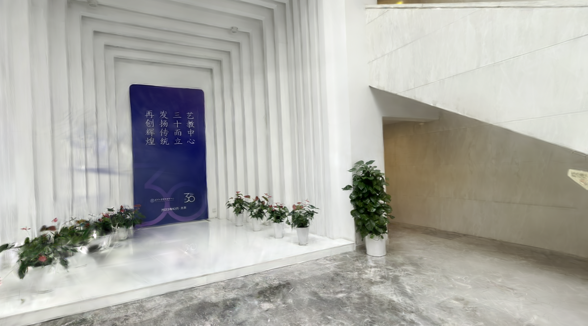
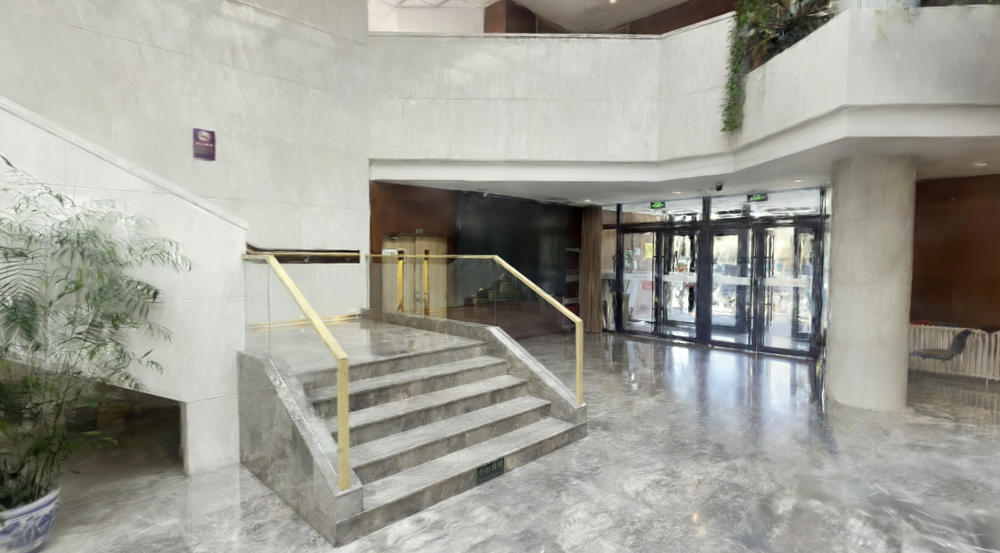
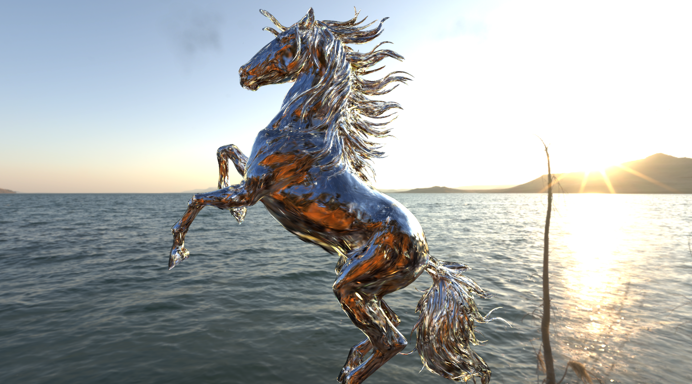

# 3DGS

何昂轩  张翔宇  唐安朗

## 完成项目

### 基础问题

Oculus实时浏览重建的3DGS场景。

代码实现参考了UnityGaussianSplatting[^1]，以上仓库已经实现了对OenXR的支持，因此仅需在Unity中增加OpenXR相关的Package并调整部分设置即可在Oculus浏览自己重建出来的3D场景。

场景重建参考Gaussian Splatting[^2]，使用自己拍摄的开放场景照片进行训练，训练参数与原仓库一致。最终重建效果参考演示视频`3DGS.mp4`。

### 进阶问题

进阶问题我们选择实现GaussianShader[^3]。

代码实现在UnityGaussianSplatting的基础上进行改进，绝大部分修改位于`<project>/package`下。具体可以分为以下部分：

1. 导入.ply点云，（压缩并）生成Unity可用的Asset。
   - GaussianShader重建生成的点云实际上只比原3DGS多出了两个法线、高光、粗糙度分量，因此仿照原本属性的生成过程即可。由于UnityGaussianSplatting仅支持3阶SH，因此原本重建出的点云需要先进行零拓展才能正常传入。
2. 读取Asset中的各个属性并将其从CPU传入GPU端。
   - 同样仿照原属性即可。
3. 增加环境光贴图。
   - GaussianShader支持重光照功能，因此需要在渲染时读取环境光贴图。对于导入的2D环境光贴图，需要使用Unity内置的功能将其转换为立方体贴图。
   - 修改对应的Shader代码，增加对specular项的计算。

场景重建参考GaussianShader[^3]，使用原仓库自带的场景进行训练。最终重建效果参考演示视频`GShader.mp4`。

## 思考和感想

- 通过复现3DGS以及GShader，我们较为全面地了解整体3DGS的工作管线是如何实现的。
- 在修改UnityGaussianSplatting部分实现GShader的过程中，我们学习了如何使用Unity的URP管线进行自定义渲染，并额外从代码中了解了如何对点云数据进行压缩的同时保证基本正确的效果。
- 在实验初期，我们也尝试了将3DGS的渲染直接搬迁到Oculus上，但发现即使重建的场景质量已经较差的情况下（约30万点云），Oculus也难以负担。因此，我们需要进一步优化3DGS的渲染管线并进一步减少渲染压力。
- 在场景重建过程中，我们也逐渐发现了3DGS和Mesh表达三维物体的优劣。对于一些非常精细或材质非常复杂的物体（如汉字、植被、皮肤等），3DGS能以较小的渲染代价就取得不错的效果，而Mesh则需要借助复杂的贴图和渲染算法才能实现与此接近的效果。但对于几何较为简单的物体，3DGS的重建效果则比Mesh差许多。因此，整合3DGS和一般光栅化渲染管线也是可以进一步研究的方向。

## 参考文献

[^1]: [https://github.com/aras-p/UnityGaussianSplatting](https://github.com/aras-p/UnityGaussianSplatting)
[^2]: [https://github.com/graphdeco-inria/gaussian-splatting](https://github.com/graphdeco-inria/gaussian-splatting)
[^3]: [https://github.com/Asparagus15/GaussianShader](https://github.com/Asparagus15/GaussianShader)
